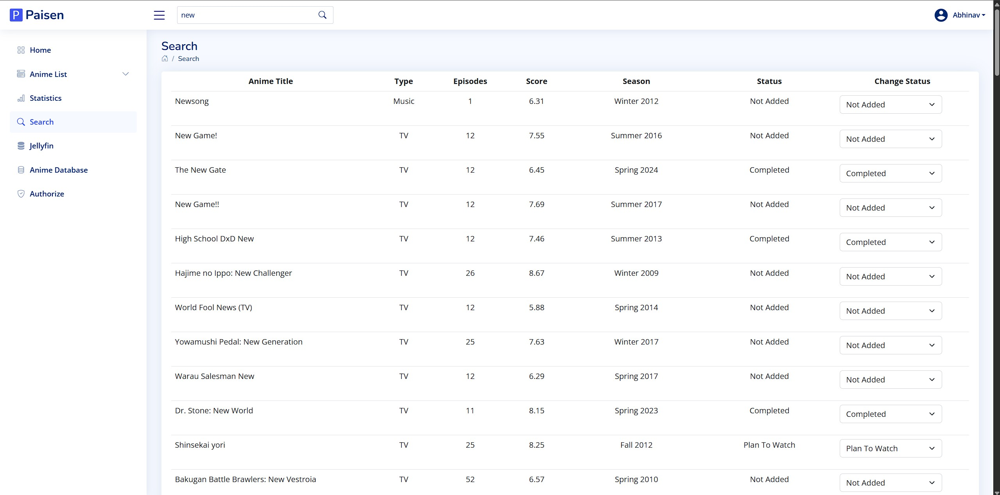

# 🎌 Paisen

> **Self-hosted MyAnimeList Manager with Jellyfin Integration**

[](https://opensource.org/licenses/MIT)
[](https://nodejs.org/)
[](https://nextjs.org/)
[](https://www.mongodb.com/)
[](https://jellyfin.org/)

**Paisen** is a powerful, self-hosted anime management application that seamlessly integrates MyAnimeList and Jellyfin to provide a comprehensive anime tracking experience. With its lightning-fast local database and intelligent cross-platform synchronization, Paisen transforms how you discover, track, and manage your anime collection.

---

## 📋 Table of Contents

- [✨ Features](#-features)
- [📸 Screenshots](#-screenshots)
- [🚀 Quick Start](#-quick-start)
- [📋 Prerequisites](#-prerequisites)
- [⚙️ Installation](#️-installation)
- [🔧 Configuration](#-configuration)
- [🎬 Jellyfin Integration](#-jellyfin-integration)
- [🔌 API Documentation](#-api-documentation)
- [🧪 Testing](#-testing)
- [🔧 Troubleshooting](#-troubleshooting)
- [🤝 Contributing](#-contributing)
- [📄 License](#-license)
- [🙏 Acknowledgments](#-acknowledgments)

---

## ✨ Features

### 🎯 Core Functionality
- **🔐 MyAnimeList Integration** - Full OAuth2 authentication with secure token management
- **📚 Anime List Management** - View, update, and organize your complete collection
- **🔍 Universal Search** - Lightning-fast search across multiple databases
- **📊 Rich Analytics** - Comprehensive statistics and watching pattern insights
- **👥 Multi-user Support** - Isolated accounts with personal data protection

### 🎬 Media Server Integration
- **⚡ Real-time Sync** - Automatic Jellyfin updates via webhooks
- **🧠 Smart Matching** - Intelligent anime identification across platforms
- **📈 Progress Tracking** - Seamless episode progress synchronization
- **📡 Server Monitoring** - Real-time connection and activity status
- **📂 Library Management** - Complete media collection overview

### 🗄️ Database & Performance
- **🚀 Lightning Speed** - 90% faster than direct API calls
- **🔍 Full-text Search** - Advanced indexing across all metadata
- **📱 Offline Support** - Complete functionality without internet
- **🆔 Universal IDs** - Cross-platform mapping (MAL, TVDB, TMDB)
- **📊 Analytics Engine** - Detailed statistics and performance metrics
- **🔄 Smart Caching** - Intelligent data synchronization and updates

---

## 📸 Screenshots

### 🏠 Dashboard & Authentication

<div align="center">

| Home Dashboard | User Registration |
|:---:|:---:|
|  |  |
| *Main dashboard with activity overview and quick access* | *Secure user registration with validation* |

| User Login | OAuth Authorization |
|:---:|:---:|
|  |  |
| *Clean login interface with authentication* | *MyAnimeList OAuth integration* |

</div>

### 📚 Anime Management

<div align="center">

| Anime List Management | Advanced Search |
|:---:|:---:|
|  |  |
| *Comprehensive anime list with status tracking* | *Powerful search with real-time results* |

</div>

### 📊 Analytics & Statistics

<div align="center">

| Statistics Overview | Score Distribution |
|:---:|:---:|
|  |  |
| *Detailed analytics and watching patterns* | *Score distribution and rating insights* |

</div>

### 🎬 Jellyfin Integration

<div align="center">

| Jellyfin Setup | Sync Management |
|:---:|:---:|
|  |  |
| *Server configuration and monitoring* | *Real-time sync with progress tracking* |

</div>

---

## 🚀 Quick Start

```bash
# Clone the repository
git clone https://github.com/ninjashari/paisen.git
cd paisen

# Install dependencies
npm install

# Set up environment variables
cp .env.local.example .env.local
# Edit .env.local with your configuration

# Start development server
npm run dev
```

🎉 **Open [http://localhost:3000](http://localhost:3000) to view Paisen**

---

## 📋 Prerequisites

Before installing Paisen, ensure you have the following:

### Required Software
- **Node.js** 18.0+ ([Download](https://nodejs.org/))
- **MongoDB** 6.0+ ([Installation Guide](https://www.mongodb.com/docs/manual/installation/))
- **Git** ([Download](https://git-scm.com/))

### Required Accounts
- **MyAnimeList Account** ([Create Account](https://myanimelist.net/register.php))
- **MyAnimeList API Application** ([Create App](https://myanimelist.net/blog.php?eid=835707))

### Optional (For Enhanced Features)
- **Jellyfin Server** ([Download](https://jellyfin.org/downloads/)) - For media server integration

---

## ⚙️ Installation

### 1. Clone Repository

```bash
git clone https://github.com/ninjashari/paisen.git
cd paisen
```

### 2. Install Dependencies

```bash
npm install
```

### 3. Environment Configuration

Create your environment file:

```bash
cp .env.local.example .env.local
```

Edit `.env.local` with your configuration:

```env
# MyAnimeList API Configuration
MAL_CLIENT_ID=your_mal_client_id_here

# Security Keys (Generate secure random strings)
SECRET=your_32_character_secret_key_here
SYNC_KEY=your_secure_sync_key_here

# Database Configuration
MONGODB_URI=mongodb://localhost:27017/paisen

# Application URL
NEXTAUTH_URL=http://localhost:3000

# Optional: Jellyfin Configuration (can be set via UI)
JELLYFIN_SERVER_URL=http://your-jellyfin-server:8096
JELLYFIN_API_KEY=your_jellyfin_api_key
```

### 4. Database Setup

Start MongoDB service:

```bash
# Ubuntu/Debian
sudo systemctl start mongod

# macOS with Homebrew
brew services start mongodb-community

# Windows
net start MongoDB
```

### 5. Build and Start

```bash
# Development mode
npm run dev

# Production mode
npm run build
npm start
```

---

## 🔧 Configuration

### MyAnimeList API Setup

1. **Visit [MyAnimeList API](https://myanimelist.net/blog.php?eid=835707)**
2. **Click "Create ID"** to create a new application
3. **Fill in application details:**
   - **App Type:** `Web`
   - **App Name:** `Paisen` (or your preferred name)
   - **App Description:** `Self-hosted anime management`
   - **App Redirect URL:** `http://localhost:3000/oauth`
   - **Homepage URL:** `http://localhost:3000/`
   - **Commercial/Non-Commercial:** `Non-Commercial`
4. **Copy the Client ID** to your `.env.local` file

### Security Configuration

Generate secure keys for your installation:

```bash
# Generate SECRET (32 characters)
openssl rand -hex 16

# Generate SYNC_KEY (any secure string)
openssl rand -base64 32
```

---

## 🎬 Jellyfin Integration

### Prerequisites
- Jellyfin Server 10.8.0 or higher
- Admin access to Jellyfin server
- Network connectivity between Paisen and Jellyfin

### Setup Steps

#### 1. Generate Jellyfin API Key

1. **Open Jellyfin Dashboard** → **Advanced** → **API Keys**
2. **Click "+" to create new API key**
3. **Enter App Name:** `Paisen`
4. **Copy the generated API key**

#### 2. Configure in Paisen

1. **Navigate to Jellyfin page** in Paisen
2. **Enter your server details:**
   - **Server URL:** `http://your-jellyfin-server:8096`
   - **API Key:** (paste from step 1)
   - **User ID:** (select from dropdown after connection)
3. **Test Connection** and **Save Configuration**

#### 3. Optional: Webhook Setup

For real-time sync when episodes are watched:

1. **In Jellyfin Dashboard** → **Plugins** → **Catalog**
2. **Install "Webhook" plugin** if not already installed
3. **Configure webhook:**
   - **Webhook URL:** `http://your-paisen-url:3000/api/jellyfin/webhook`
   - **Events:** `Playback Stop`, `Item Added`
4. **Save webhook configuration**

### Features

- **🔄 Automatic Sync** - Updates when episodes are watched
- **📊 Progress Tracking** - Episode progress syncs to MyAnimeList
- **🎯 Smart Matching** - Intelligent anime identification
- **📈 Real-time Monitoring** - Server status and activity tracking

---

## 🔌 API Documentation

### Authentication Endpoints

| Endpoint | Method | Description | Authentication |
|----------|--------|-------------|----------------|
| `/api/auth/[...nextauth]` | GET/POST | NextAuth.js authentication | None |

### Data Retrieval Endpoints

| Endpoint | Method | Description | Authentication |
|----------|--------|-------------|----------------|
| `/api/anime/list` | GET | Query local anime database | Session |
| `/api/user/[username]` | GET | Get user profile and stats | Session |

### Integration Endpoints

| Endpoint | Method | Description | Authentication |
|----------|--------|-------------|----------------|
| `/api/jellyfin/config` | GET/POST | Jellyfin server configuration | Session |
| `/api/jellyfin/sync` | POST | Manual Jellyfin synchronization | Session |
| `/api/jellyfin/webhook` | POST | Jellyfin webhook handler | Webhook Key |
| `/api/jellyfin/test` | GET | Test Jellyfin connection | Session |

### Status and Monitoring

| Endpoint | Method | Description | Authentication |
|----------|--------|-------------|----------------|
| `/api/sync/progress/[sessionId]` | GET | Sync progress monitoring | Session |

---

## 🧪 Testing

Paisen includes comprehensive test suites for all major components.

### Running Tests

```bash
# Run all tests
npm test

# Run tests with coverage
npm run test:coverage

# Run tests in watch mode
npm run test:watch

# Run specific test suites
npm test -- --testPathPattern=jellyfin
npm test -- --testPathPattern=integration
```

### Test Categories

#### Unit Tests
- **Jellyfin Integration** - Server communication, webhook handling
- **Database Models** - Data validation, relationships
- **Utility Functions** - Helper functions, data transformation

#### Integration Tests
- **API Endpoints** - HTTP request/response handling
- **Authentication Flow** - Session management, OAuth
- **Database Operations** - CRUD operations, data consistency
- **External API Integration** - MyAnimeList, Jellyfin

#### End-to-End Tests
- **Complete User Workflows** - Registration to anime tracking
- **Cross-platform Sync** - Data consistency across services
- **Error Recovery** - Graceful handling of failures
- **Performance Benchmarks** - Response times, throughput

### Test Coverage Goals

| Component | Target Coverage |
|-----------|----------------|
| **API Endpoints** | 90%+ |
| **Database Models** | 85%+ |
| **Core Libraries** | 90%+ |
| **Utility Functions** | 95%+ |
| **Integration Flows** | 80%+ |

### Running Specific Tests

```bash
# Test Jellyfin integration
npm test __tests__/jellyfin-simple.test.js
```

---

## 🔧 Troubleshooting

### Common Issues and Solutions

#### MyAnimeList Issues

**❌ Authentication Failed**
```
Error: Invalid client credentials
```
**✅ Solution:**
1. Verify `MAL_CLIENT_ID` in `.env.local`
2. Check redirect URL in MAL app settings: `http://localhost:3000/oauth`
3. Ensure app is approved and active

**❌ Token Expired**
```
Error: Access token has expired
```
**✅ Solution:**
1. Navigate to OAuth page in Paisen
2. Re-authorize your MyAnimeList account
3. Check token expiry in user settings

#### Jellyfin Issues

**❌ Connection Failed**
```
Error: Unable to connect to Jellyfin server
```
**✅ Solution:**
1. Verify server URL format: `http://server:8096`
2. Check API key is valid and has permissions
3. Ensure network connectivity
4. Test server accessibility from browser

**❌ Sync Issues**
```
Error: Failed to sync anime data
```
**✅ Solution:**
1. Check anime library permissions
2. Verify metadata providers are configured
3. Ensure TVDB/TMDB IDs are present
4. Review sync logs for specific errors

**❌ Webhook Not Working**
```
Warning: Webhook events not received
```
**✅ Solution:**
1. Verify webhook URL is accessible: `http://paisen:3000/api/jellyfin/webhook`
2. Check Jellyfin webhook plugin configuration
3. Ensure correct events are selected
4. Test webhook manually

#### Database Issues

**❌ Connection Error**
```
Error: MongoNetworkError: connect ECONNREFUSED
```
**✅ Solution:**
1. Start MongoDB service: `sudo systemctl start mongod`
2. Check connection string in `.env.local`
3. Verify MongoDB is listening on correct port
4. Check disk space and permissions

**❌ Performance Issues**
```
Warning: Slow database queries
```
**✅ Solution:**
1. Check available disk space
2. Monitor MongoDB performance
3. Consider adding database indexes
4. Review query patterns in logs

#### General Issues

**❌ Application Won't Start**
```
Error: Cannot find module 'next'
```
**✅ Solution:**
1. Run `npm install` to install dependencies
2. Check Node.js version (requires 18+)
3. Clear node_modules and reinstall: `rm -rf node_modules && npm install`
4. Check for conflicting global packages

**❌ Build Errors**
```
Error: Build failed with errors
```
**✅ Solution:**
1. Check syntax errors in code
2. Verify all environment variables are set
3. Run `npm run build` to see detailed errors
4. Check for missing dependencies

### Getting Help

#### 1. Built-in Diagnostics

- **Jellyfin Page** → Test Connection button
- **Jellyfin Info Page** → Server Status and sync testing
- **Browser Console** → Check for client-side errors
- **Network Tab** → Monitor API requests and responses

#### 2. Log Analysis

```bash
# Check application logs
npm run dev  # Development logs in console

# Check MongoDB logs
sudo tail -f /var/log/mongodb/mongod.log

# Check system logs
sudo journalctl -u mongod -f
```

#### 3. Debug Mode

Enable debug logging in `.env.local`:

```env
NODE_ENV=development
DEBUG=paisen:*
```

#### 4. Community Support

- **GitHub Issues:** [Report bugs and request features](https://github.com/ninjashari/paisen/issues)
- **Discussions:** [Ask questions and share ideas](https://github.com/ninjashari/paisen/discussions)
- **Wiki:** [Detailed documentation and guides](https://github.com/ninjashari/paisen/wiki)

When reporting issues, please include:
- Operating system and version
- Node.js and npm versions
- Error messages and logs
- Steps to reproduce the issue
- Screenshots if applicable

---

## 🤝 Contributing

We welcome contributions from the community! Whether you're fixing bugs, adding features, improving documentation, or helping with testing, your contributions make Paisen better for everyone.

### 🚀 Quick Start for Contributors

```bash
# Fork the repository on GitHub
# Clone your fork
git clone https://github.com/YOUR_USERNAME/paisen.git
cd paisen

# Add upstream remote
git remote add upstream https://github.com/ninjashari/paisen.git

# Create a feature branch
git checkout -b feature/your-feature-name

# Make your changes and commit
git add .
git commit -m "feat: add your feature description"

# Push to your fork and create a pull request
git push origin feature/your-feature-name
```

### 📋 Contribution Guidelines

#### Code Style
- Follow existing code style and conventions
- Use meaningful variable and function names
- Add comments for complex logic
- Include JSDoc comments for functions
- Run `npm run lint` before committing

#### Testing
- Write tests for new features
- Ensure all existing tests pass
- Aim for high test coverage
- Include both unit and integration tests

#### Documentation
- Update README.md for new features
- Add inline code comments
- Update API documentation
- Include screenshots for UI changes

#### Pull Request Process
1. **Create an issue** first to discuss major changes
2. **Keep PRs focused** on a single feature or bug fix
3. **Write clear commit messages** following conventional commits
4. **Include tests** for new functionality
5. **Update documentation** as needed
6. **Request review** from maintainers

### 🎯 Areas for Contribution

#### 🐛 Bug Fixes
- Fix reported issues
- Improve error handling
- Enhance stability
- Performance optimizations

#### ✨ New Features
- Additional anime databases integration
- Enhanced search capabilities
- Mobile app development
- Advanced analytics features

#### 📚 Documentation
- Improve setup guides
- Add troubleshooting sections
- Create video tutorials
- Translate documentation

#### 🧪 Testing
- Increase test coverage
- Add integration tests
- Performance benchmarking
- Cross-platform testing

#### 🎨 UI/UX Improvements
- Design enhancements
- Accessibility improvements
- Mobile responsiveness
- User experience optimization

### 🏷️ Commit Convention

We use [Conventional Commits](https://www.conventionalcommits.org/):

```
feat: add new search functionality
fix: resolve authentication token expiry issue
docs: update installation guide
test: add integration tests for Jellyfin sync
refactor: improve database query performance
style: fix code formatting issues
```

### 📝 Issue Templates

When creating issues, please use our templates:

- **🐛 Bug Report:** For reporting bugs
- **✨ Feature Request:** For suggesting new features
- **📚 Documentation:** For documentation improvements
- **❓ Question:** For asking questions

---

## 📄 License

This project is licensed under the **MIT License** - see the [LICENSE](LICENSE) file for details.

### What this means:
- ✅ **Commercial use** - You can use this software commercially
- ✅ **Modification** - You can modify the source code
- ✅ **Distribution** - You can distribute the software
- ✅ **Private use** - You can use this software privately
- ❌ **Liability** - The authors are not liable for any damages
- ❌ **Warranty** - No warranty is provided with this software

---

## 🙏 Acknowledgments

### 🌟 Core Technologies
- **[Next.js](https://nextjs.org/)** - React framework for production
- **[MongoDB](https://www.mongodb.com/)** - Document database for data storage
- **[NextAuth.js](https://next-auth.js.org/)** - Authentication for Next.js
- **[Bootstrap](https://getbootstrap.com/)** - CSS framework for responsive design

### 🔌 External Services
- **[MyAnimeList](https://myanimelist.net/)** - Primary anime database and user lists
- **[Jellyfin](https://jellyfin.org/)** - Open source media server integration
- **[TVDB](https://thetvdb.com/)** - Television database for additional metadata

### 👥 Community
- **Contributors** - Everyone who has contributed code, documentation, or feedback
- **Beta Testers** - Users who helped test and improve the application
- **Community Members** - Active participants in discussions and support

### 🎨 Design Resources
- **[Bootstrap Icons](https://icons.getbootstrap.com/)** - Icon library
- **[Unsplash](https://unsplash.com/)** - Stock photos for documentation
- **Community Screenshots** - User-contributed interface examples

---

<div align="center">

### 🎌 Made with ❤️ for the Anime Community

**[⭐ Star this project](https://github.com/ninjashari/paisen)** • **[🐛 Report Issues](https://github.com/ninjashari/paisen/issues)** • **[💬 Join Discussions](https://github.com/ninjashari/paisen/discussions)**

</div> 