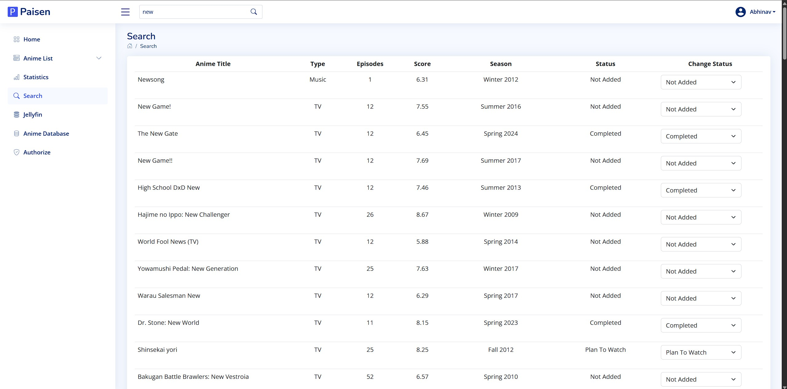
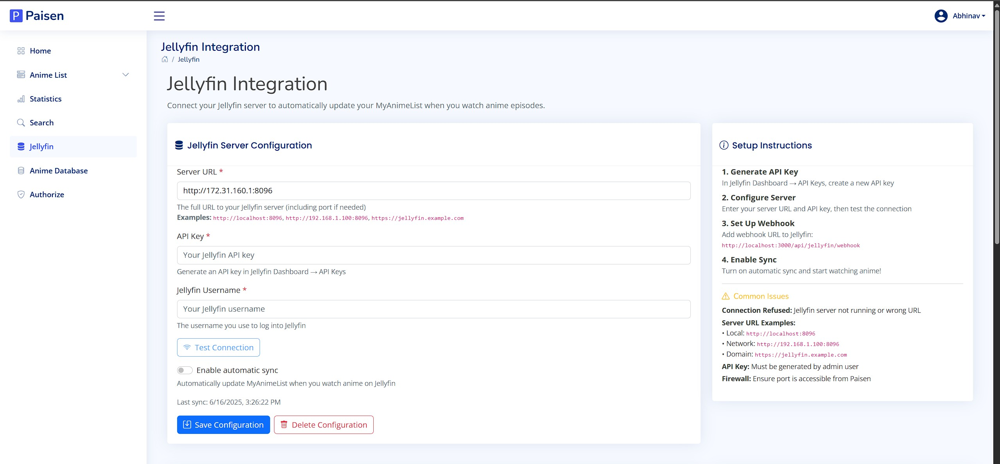
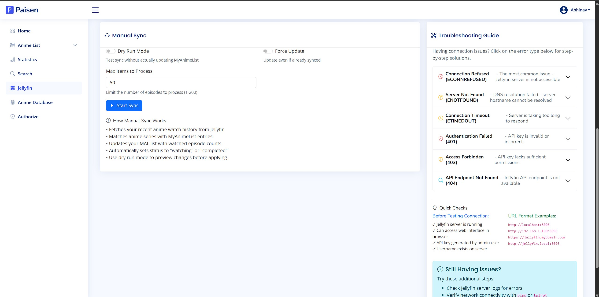

# 🎌 Paisen

### Self-hosted MyAnimeList Manager with Jellyfin Integration & Local Database

[](https://opensource.org/licenses/MIT)
[](https://nodejs.org/)
[](https://nextjs.org/)
[](https://www.mongodb.com/)
[](https://jellyfin.org/)

## 🎯 Overview

**Paisen** is a powerful, self-hosted MyAnimeList management application that brings your anime collection to your own server. With seamless Jellyfin integration and a lightning-fast local database, Paisen transforms how you track and manage your anime watching experience.

### Why Paisen?

- **🚀 90% faster** anime list loading with local database
- **🎬 Automatic sync** with your Jellyfin media server
- **🔍 Advanced search** with full-text indexing
- **📱 Offline capabilities** for when you're disconnected
- **🆔 Universal compatibility** with AniDB, TVDB, TMDB mappings
- **📊 Rich analytics** and comprehensive statistics
- **🛡️ Self-hosted** - your data stays on your server

## ✨ Features

### 🎯 Core Features
- **MyAnimeList Integration**: Full OAuth2 integration with secure token management
- **Anime List Management**: View, update, and organize your anime collection
- **Advanced Search**: Lightning-fast search across titles, genres, and studios
- **Statistics Dashboard**: Comprehensive analytics and watching patterns
- **Multi-user Support**: Isolated user accounts with personal data

### 🎬 Jellyfin Integration
- **Real-time Sync**: Automatic updates via webhooks when you finish episodes
- **Manual Sync**: On-demand synchronization with flexible options
- **Intelligent Matching**: Multiple strategies for anime identification
- **Dry Run Mode**: Preview changes before applying them
- **Server Monitoring**: Real-time connection status and activity tracking
- **Library Overview**: Complete view of your Jellyfin anime collection

### 🗄️ Local Database
- **⚡ Performance**: 90% faster than direct MAL API calls
- **🔍 Enhanced Search**: Full-text indexing across all metadata
- **📱 Offline Access**: Browse your collection without internet
- **🆔 External IDs**: AniDB, TVDB, TMDB, IMDB mappings
- **📊 Analytics**: Detailed statistics and sync performance metrics
- **🔄 Smart Sync**: Incremental updates with change detection

## 📸 Screenshots

### 🏠 Home Dashboard

*Main dashboard with anime activity overview, recent updates, and quick access to features*

### 👤 User Authentication


*Secure user management with OAuth2 integration for MyAnimeList*

### 📚 Anime Management

*Comprehensive anime list with status tracking, scores, and progress management*

### 🔍 Search & Discovery

*Advanced search with real-time results and intelligent filtering*

### 📊 Statistics & Analytics


*Detailed analytics showing watching patterns and scoring trends*

### 🎬 Jellyfin Integration


*Complete Jellyfin integration with server monitoring and sync management*

## 🚀 Installation

### Prerequisites

- **Node.js** 18+ ([Download](https://nodejs.org/))
- **MongoDB** 6.0+ ([Installation Guide](https://www.mongodb.com/docs/manual/installation/))
- **MyAnimeList Account** ([Create Account](https://myanimelist.net/register.php))
- **Jellyfin Server** (Optional, for media integration)

### Quick Start

```bash
# 1. Clone repository
git clone https://github.com/ninjashari/paisen.git
cd paisen

# 2. Install dependencies
npm install

# 3. Setup environment
cp .env.local.example .env.local
# Edit .env.local with your configuration

# 4. Build and start
npm run build
npm start
```

🎉 **Paisen is now running at** `http://localhost:3000`

## ⚙️ Configuration

### MyAnimeList API Setup

1. Visit [MyAnimeList API](https://myanimelist.net/blog.php?eid=835707)
2. Create new application:
   - **App Type**: Other
   - **App Redirect URL**: `http://localhost:3000/oauth`
   - **Homepage URL**: `http://localhost:3000/`
3. Add Client ID to `.env.local`

### Environment Variables

```env
# MyAnimeList Integration
MAL_CLIENT_ID=your_mal_client_id

# Security
SECRET=your_32_character_secret_key
SYNC_KEY=your_secure_sync_key

# Database
MONGODB_URI=mongodb://localhost:27017/paisen

# Application
NEXTAUTH_URL=http://localhost:3000
```

## 🎬 Jellyfin Integration

### Setup Steps

1. **Generate API Key** in Jellyfin Dashboard → API Keys
2. **Configure in Paisen** via "Jellyfin" page
3. **Setup Webhook** (Optional): `http://your-paisen-url:3000/api/jellyfin/webhook`

### How It Works

- **Automatic**: Webhooks trigger updates when episodes are watched
- **Manual**: On-demand sync with flexible options
- **Intelligent Matching**: Multiple identification strategies
- **Progress Tracking**: Episodes automatically update MAL progress

## 🗄️ Local Database

### Benefits

| Feature | Local Database | Direct MAL API |
|---------|---------------|----------------|
| **Speed** | ⚡ Sub-second | 🐌 3-5 seconds |
| **Search** | 🔍 Full-text | 📝 Basic |
| **Offline** | ✅ Available | ❌ Requires internet |
| **External IDs** | ✅ AniDB/TVDB/TMDB | ❌ MAL only |
| **Analytics** | 📊 Rich insights | 📈 Basic stats |

### Initial Sync

1. Navigate to **Anime Database** page
2. Enable "Include External IDs"
3. Click "Sync Anime List"
4. Monitor progress and review results

## 🔌 API Documentation

### Core Endpoints

| Endpoint | Method | Description |
|----------|--------|-------------|
| `/api/anime/sync` | GET/POST | Sync management |
| `/api/anime/list` | GET | Query local database |
| `/api/database/anime-stats` | GET | Collection statistics |
| `/api/jellyfin/config` | GET/POST | Server configuration |

### Interactive Testing

Visit the **Anime Database** page for real-time API testing with response inspection.

## 🧪 Testing

```bash
# Run tests
npm test

# Run with coverage
npm run test:coverage

# Watch mode
npm run test:watch
```

Coverage targets: 80%+ statements, 75%+ branches, 80%+ functions/lines

## 🔧 Troubleshooting

### Common Issues

- **Authentication**: Re-authorize MAL account if token expires
- **Sync Problems**: Check internet connection and MAL API access
- **Jellyfin Issues**: Verify server URL, API key, and permissions
- **Database Issues**: Check MongoDB connection and disk space

### Getting Help

1. Check **Database Info** page for sync status
2. Review server logs for detailed errors
3. Use interactive API testing
4. Report issues on GitHub

## 🤝 Contributing

We welcome contributions! Areas include:

- 🐛 Bug fixes and issue reports
- ✨ New features and enhancements
- 📚 Documentation improvements
- 🧪 Test coverage expansion
- 🎨 UI/UX improvements

### Development Setup

1. Fork and clone repository
2. Install dependencies: `npm install`
3. Start dev server: `npm run dev`
4. Run tests: `npm test`

## 📄 License

MIT License - see [LICENSE](LICENSE) file for details.

## 🙏 Acknowledgments

- [MyAnimeList](https://myanimelist.net/) - Anime database and API
- [Jellyfin](https://jellyfin.org/) - Open source media server
- [shinkrodb](https://github.com/varoOP/shinkrodb) - External ID mappings
- [anime-offline-database](https://github.com/manami-project/anime-offline-database) - Comprehensive anime data

## ⚠️ Disclaimer

This is a hobby project under active development. Some features may not work as expected. Use at your own risk and always backup your data.

---

Made with ❤️ for the anime community 