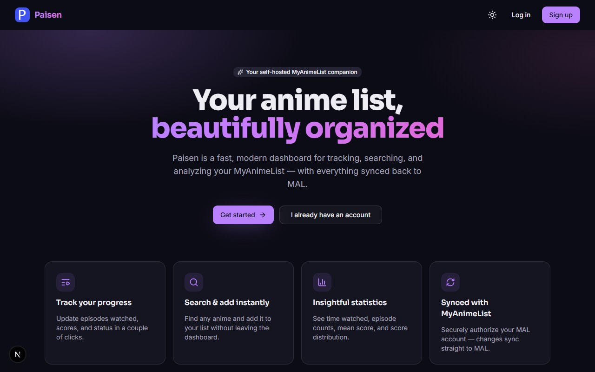
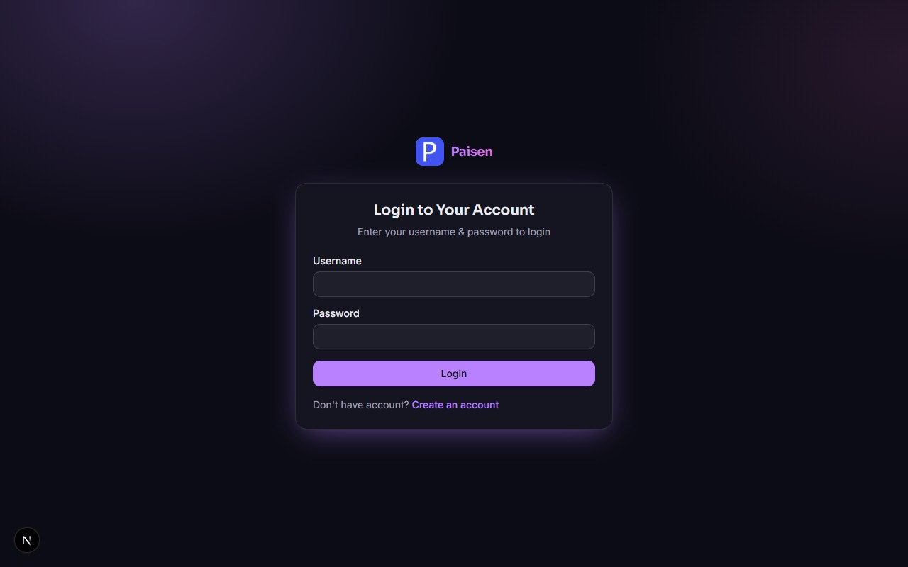
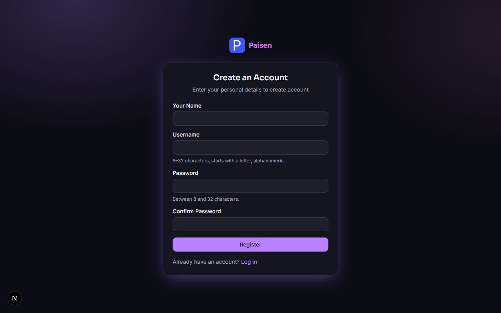

# Paisen

> **Self-hosted MyAnimeList tracker**

[](https://opensource.org/licenses/MIT)
[](https://nodejs.org/)
[](https://nextjs.org/)
[](https://www.mongodb.com/)

**Paisen** is a fast, self-hosted dashboard for tracking, searching, and analyzing your MyAnimeList — synced straight to MAL.

---

## Screenshots

| Home | Login | Register |
|:---:|:---:|:---:|
|  |  |  |
| *Landing page with feature overview* | *Credential login with hashed password* | *Account creation with validation* |

> App screenshots (anime list, search, statistics) require a linked MyAnimeList account. See [Features](#features) for what each page provides.

---

## Features

### Authentication & accounts
- Multi-user support — each account has its own isolated data
- Passwords hashed client-side (SHA-256) before transit, then bcrypt-stored server-side
- Session management via NextAuth.js (JWT strategy, 30-day tokens)
- MyAnimeList OAuth2 (PKCE) integration — link your MAL account per user

### Anime list management
- View your list split by status: **Currently Watching**, **Completed**, **On Hold**, **Dropped**, **Plan to Watch**
- Inline status update (change watching → completed, etc.) without leaving the page
- Inline score update (0–10) per entry
- Inline episode count update

### Search & discovery
- Search any anime by title via the MAL API
- See your current watch status and score inline with results
- Add or update entries directly from search

### Statistics
- Mean score across your list
- Total episodes watched and total time spent
- Score distribution chart
- Breakdown by watch status

### Technical
- All MAL API calls are **server-side proxied** — no access token ever reaches the browser
- Token refresh flow via `/api/mal/refresh`
- Light / dark theme toggle (system default, persisted)
- Error states with retry on all data-loading pages — no infinite spinners
- Toast notifications for mutations (score, status, episode updates)

---

## Pages

| Route | Description |
|---|---|
| `/` | Landing page (login / sign-up CTAs) |
| `/login` | Credential login |
| `/register` | New account creation |
| `/authorise` | Link your MyAnimeList account (OAuth PKCE) |
| `/oauth` | MAL OAuth callback handler |
| `/animelist/current` | Currently watching |
| `/animelist/completed` | Completed |
| `/animelist/onhold` | On hold |
| `/animelist/dropped` | Dropped |
| `/animelist/plantowatch` | Plan to watch |
| `/search` | Anime search |
| `/statistics` | Watch statistics and charts |

---

## Prerequisites

- **Node.js** 18+
- **MongoDB** — local instance or [MongoDB Atlas](https://www.mongodb.com/atlas) (free tier works)
- **MyAnimeList API application** — [create one here](https://myanimelist.net/apiconfig)

---

## Installation

```bash
# 1. Clone
git clone https://github.com/ninjashari/paisen.git
cd paisen

# 2. Install dependencies
npm install

# 3. Configure environment
cp .env.local.example .env.local
# Edit .env.local — see Configuration below

# 4. Start dev server
npm run dev
```

Open [http://localhost:3001](http://localhost:3001).

For production:

```bash
npm run build
npm start
```

---

## Configuration

Create `.env.local` in the project root:

```env
# MongoDB connection string — include the database name
MONGODB_URI=mongodb://127.0.0.1:27017/paisen
# or Atlas:
# MONGODB_URI=mongodb+srv://<user>:<pass>@cluster.mongodb.net/paisen?retryWrites=true&w=majority

# NextAuth — generate with: openssl rand -hex 32
SECRET=your_secret_here

# Your app's public URL (no trailing slash)
NEXTAUTH_URL=http://localhost:3001

# MyAnimeList Client ID from https://myanimelist.net/apiconfig
MAL_CLIENT_ID=your_mal_client_id_here
```

### MyAnimeList API setup

1. Go to [myanimelist.net/apiconfig](https://myanimelist.net/apiconfig) and click **Create ID**
2. Fill in the form:
   - **App Type:** Web
   - **App Redirect URL:** `http://localhost:3001/oauth` (or your production URL + `/oauth`)
3. Copy the **Client ID** to `.env.local`

---

## First-time setup

1. Start the app and go to `/register` — create a Paisen account
2. Log in at `/login`
3. Go to `/authorise` — enter your MyAnimeList username and click **Authorize**
4. You'll be redirected to MAL to approve access, then back to your anime list

---

## Tech stack

| Layer | Technology |
|---|---|
| Framework | Next.js 16 (Pages Router) |
| UI | React 19, Tailwind CSS v4, shadcn/ui (Radix UI) |
| Auth | NextAuth.js v4 (CredentialsProvider, JWT) |
| Database | MongoDB + Mongoose 9 |
| Charts | ApexCharts + react-apexcharts |
| Icons | Lucide React |
| Toasts | Sonner |
| Theme | next-themes (light / dark / system) |

---

## Troubleshooting

**Login fails with correct credentials**
- Ensure your `MONGODB_URI` includes the database name: `.../paisen?retryWrites=true`
- Check MongoDB Atlas → Network Access → your IP is allowlisted (or set `0.0.0.0/0` for testing)

**MAL returns 405 or CORS error**
- All MAL calls go through `/api/mal/*` server routes — if you see direct calls to `api.myanimelist.net` in the Network tab, the proxy routes are not being used correctly

**"Authorize your MyAnimeList account" error after login**
- Go to `/authorise` and complete the OAuth flow — the MAL access token is not yet stored

**Token expired**
- Use the refresh button (sync icon) in the app header to exchange your refresh token for a new access token

**Build fails (`Cannot find module`)**
- Run `npm install` then `npm run build` again
- Ensure `NEXTAUTH_URL`, `SECRET`, `MONGODB_URI`, and `MAL_CLIENT_ID` are all set

---

## License

MIT — see [LICENSE](LICENSE) for details.

---

<div align="center">

Made for the anime community · [Report Issues](https://github.com/ninjashari/paisen/issues) · [Discussions](https://github.com/ninjashari/paisen/discussions)

</div>
